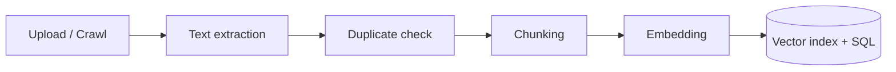

# Documents

**Documents** are the materials your assistant is grounded in: files you upload, web pages you crawl, and content imported from integrations like Canvas, PubMed, or GitHub.

## The ingest pipeline

Whenever you add a document, it flows through the same pipeline:

1. **Text extraction** — a type-specific ingest function extracts text from the file (PDF, Word, PowerPoint, HTML, video transcription with Whisper, and so on).
2. **Duplicate check** — content-based matching prevents re-ingesting identical documents (see below).
3. **Chunking** — text is split into overlapping chunks small enough for the embedding model.
4. **Embedding** — each chunk is converted into a vector using the configured embedding model.
5. **Storage** — vectors go to the vector database (Qdrant); text and metadata go to SQL and object storage.

Ingest is asynchronous and queued, so large uploads don't overwhelm the system. Failed ingests are retried automatically with exponential backoff. The Materials page shows a success or failure indicator for each document as ingestion progresses.

## Duplicate handling

There are two pathways for new documents — direct file upload and web crawl — and both share content-based deduplication, performed after text extraction:

- The database is queried by `s3_path` (uploads) or `url` (crawls).
- If nothing matches, the document is new and is ingested.
- If a document with the exact same filename or URL exists, contents are compared:
    - **Contents match** → the incoming document is a duplicate and is *not* ingested.
    - **Contents differ** → it is treated as an updated version; the old document is removed and the new one ingested.

## Document groups

Documents can be organized into **groups** (for example "Lectures", "Homework", "Extension articles"). Users can enable or disable groups in chat settings to scope retrieval to a subset of the knowledge base.

## Deleting documents

Deleting a document removes it from retrieval for future conversations. Citations in past conversations remain visible.

## Next steps

- [Uploading Materials](../guides/uploading-materials.md) — supported formats and upload methods.
- [Retrieval](retrieval.md) — how documents are found at question time.
