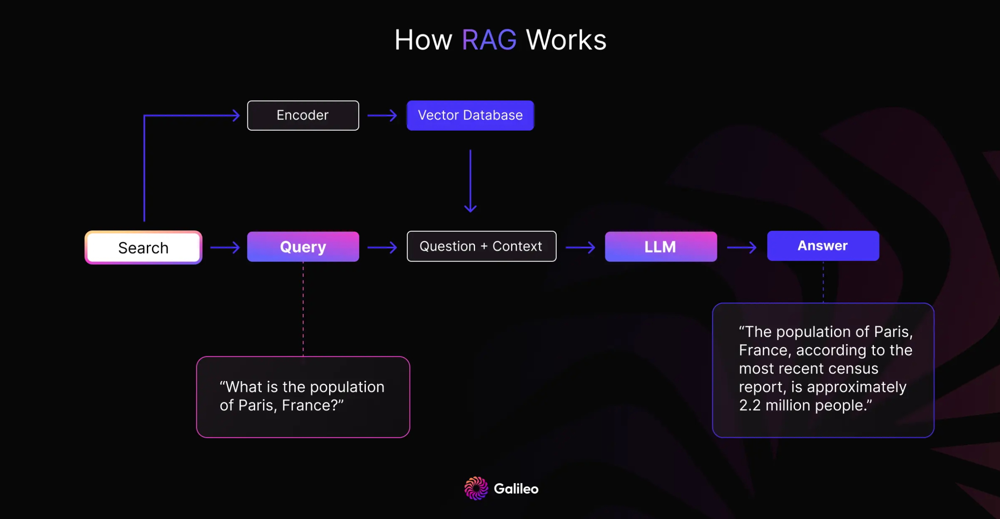

# Retrieval

In retrieval-augmented generation (RAG), the quality of an answer depends on actually retrieving the context needed to answer the question — finding the "needle in the haystack" of relevant documents. Illinois Chat supports several retrieval methods, in increasing order of sophistication.

## 1. Standard vector retrieval

The default method. The user's query is embedded and compared against the embeddings of all document chunks in the project. The top matches (up to 80 chunks) are included in the final LLM call.

## 2. Parent document retrieval

*Parent document retrieval* expands the context around retrieved chunks: for each of the top 5 chunks, the 2 preceding and 2 following chunks are also retrieved.

This solves the "off by one" problem. For example, a query like *"What is the solution to the Bernoulli equation?"* may match a textbook's *problem setup* but not the *solution* that follows in subsequent paragraphs. Expanding the context captures both. This works particularly well for textbook-style questions.

## 3. Multi-query retrieval with filtering

**Key idea:** use an LLM to diversify the query, then use a small LLM to filter out irrelevant passages before the (much more expensive) final answer generation.

The retrieval data flow:

1. User query →
2. an LLM generates multiple similar queries with more keywords →
3. vector retrieval and reranking →
4. a small LLM filters out irrelevant passages →
5. parent documents are fetched for the top 5 passages →
6. the final passage set goes to the large LLM for answer generation.

The trade-off is latency: LLM filtering adds seconds even when fully parallelized, in exchange for higher precision.

## 4. LLM-guided retrieval

**Key idea:** retrieval as tool use. Mirroring how a human researches, the LLM decides whether the retrieved context is relevant and — more importantly — *where to look next*, choosing between actions like "next page", "previous page", or "jump to section" to explore documents and find the best passages.

LLM-guided retrieval thrives on structured documents. For scientific PDFs, the recommended parsing pipeline is:

!!! info "Scientific PDF parsing, TL;DR"
    1. Start with [**Grobid**](https://github.com/kermitt2/grobid) — excellent at parsing sections and references, and the [doc2json wrapper](https://github.com/allenai/s2orc-doc2json) makes the output easy to consume.
    2. Re-run with [**Unstructured**](https://github.com/Unstructured-IO/unstructured) — its `yolox` model is best at parsing tables accurately; replace Grobid's figures/tables with Unstructured's.
    3. For math (LaTeX), use [**Nougat**](https://github.com/facebookresearch/nougat) — best at converting rendered math back to LaTeX (requires a GPU).

## Choosing a method

| Method | Precision | Latency | Best for |
| --- | --- | --- | --- |
| Standard vector | Good | Fastest | General use (default) |
| Parent document | Better | Fast | Textbooks, sequential material |
| Multi-query + filtering | High | Slower | Precision-critical questions |
| LLM-guided | Highest | Slowest | Structured/scientific documents |

Programmatic access to retrieval (without answer generation) is available via the [Retrieval API](../api/retrieval.md) and the `retrieval_only` flag of the [Chat API](../api/chat.md).
