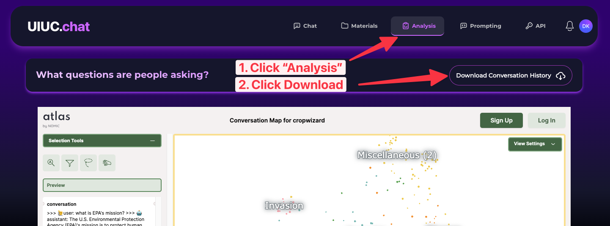
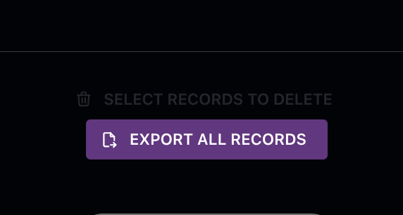

# Bulk Export

Your data is yours. Export it for detailed analysis of user conversations, or to move to another service.

## Export all conversations



From the **Analysis** page, download *all* conversations anyone has had in your project. Only the project owner and admins can access these sensitive details.

### Data format

Exports are JSON Lines (`.jsonl`), one conversation per row:

- If a user was authenticated when chatting, their email address is included; otherwise `null`.
- Messages mirror [OpenAI's chat format](https://platform.openai.com/docs/api-reference/chat/create) (`role`/`content` pairs).
- Each `assistant` message additionally includes the `contexts` that were (potentially) used to answer — up to 80 contexts per response, each with `text`, `readable_filename`, `s3_path`, `url`, and `pagenumber` metadata.

### Reading the export

```python
import jsonlines
import pprint

filename = 'myProject-convo_history.jsonl'
with jsonlines.open(filename) as f:
    data = list(f)

print(len(data))
pprint.pprint(data[0])
```

Each row looks like:

```json
{
  "convo_id": "03a9ffb3-5bde-4766-a4eb-66dff42ed8ac",
  "course_name": "my-project",
  "user_email": "user@illinois.edu",
  "created_at": "2025-08-14T16:35:40.508062-07:00",
  "convo": {
    "model": {"id": "gpt-4o", "name": "GPT-4o"},
    "prompt": "Your system prompt...",
    "temperature": 0.4,
    "messages": [
      {"role": "user", "content": "...", "contexts": []},
      {"role": "assistant", "content": "...", "contexts": [{"text": "...", "readable_filename": "...", "url": "...", "pagenumber": ""}]}
    ]
  }
}
```

## Export all documents



From the bottom of the **Materials** page, download the post-processed text and vector embeddings used by the LLM, also as JSON Lines. To minimize data-transfer costs, exporting *original* files (PDFs, etc.) is only available per-document.

## Programmatic export

Exports are also available via the API — see [Export API](../api/export.md).
