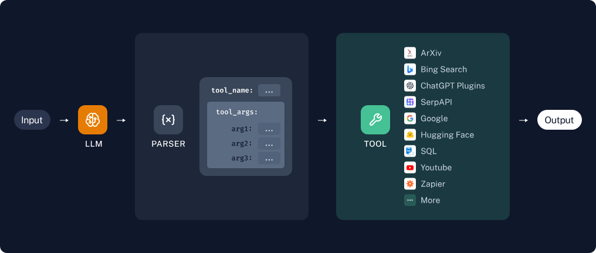
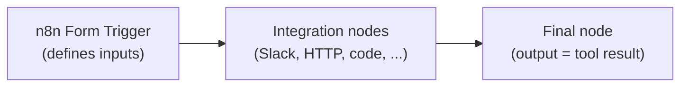

# Tools & Workflows

Tools let your assistant take real actions during a conversation: query databases, post notifications, create tickets, call APIs, or run computations. The LLM decides when a tool is relevant, generates its input parameters, invokes it, and folds the result into its answer.



## How tool selection works

1. The user sends a message.
2. The LLM compares the message against the titles and descriptions of the tools enabled in the project.
3. If a tool matches, the LLM generates the input parameters and the platform invokes it (multiple tools can run in parallel).
4. The tool output — text and/or images — is passed back to the LLM to generate the final response.

Tools are invoked automatically based on the LLM's judgment; there is no way to force invocation, but you can encourage it through prompting. For reliable instruction-following, a strong commercial model is always used for tool selection, regardless of the project's default model. Available tools appear under settings on the chat page.

## Building tools with N8N

Tools are defined visually in a self-hosted [n8n](https://n8n.io/) workflow builder — chosen for its [massive library of integrations](https://n8n.io/integrations/) (Slack, Jira, Google Drive, Gmail, databases, HTTP, ...), its [template library](https://n8n.io/workflows/), and features like drag-and-drop editing and inline code nodes.

A tool is an n8n workflow with three parts:



### Inputs

!!! warning "Every tool must start with an `n8n Form Trigger`"
    The Form Trigger defines your tool's inputs. The AI uses the **Form Title**, **Form Description**, and **Form Fields** to decide when and how to use your tool — make them as descriptive as possible.

Parameters can be required or optional, and you can define as many as you like.

### Outputs

No explicit return statement is needed: **the output of the last node is the tool's return value.** Tools can return arbitrary JSON.

### Images

Images are passed as an array of `image_urls` in a JSON object — URLs only, no raw binary data:

```json
{
  "image_urls": ["https://example.com/img-1.png", "https://example.com/img-2.png"],
  "other-useful-text": "These images depict the circle of life in the savanna."
}
```

- **Image input** — add `image_urls` as a field in your Form Trigger. n8n form fields are text, so parse the JSON array manually in code nodes:

    ```python
    image_urls = post_body.get('image_urls', [])
    if image_urls and isinstance(image_urls, str):
        image_urls = json.loads(image_urls)
    ```

- **Image output** — return a JSON object with a top-level `image_urls` key. The images render inline in the chat, and the final LLM can see them. You can mix images with any other JSON data.

## Recommended pattern

In practice, the most flexible tools are a two-node workflow: an **n8n Form Trigger** followed by an **HTTP Request** to a Python endpoint you host. Define arbitrary Python functions, expose them over HTTP (any serverless platform works), and let n8n handle the plumbing.

## Using tools in your project

1. Define tools under `https://chat.illinois.edu/<your-project>/tools`.
2. Enable the tools you want active in your project.
3. Start chatting — tools are invoked as needed.

See the [tools demo video](../getting-started/video-walkthroughs.md#tools-demo) for a walkthrough.
