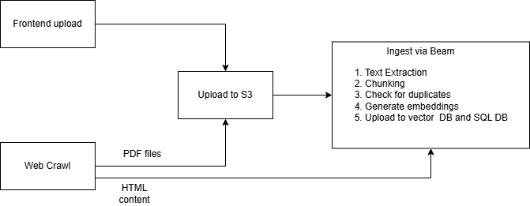

# Web Crawling

The built-in crawler discovers and ingests linked pages starting from a URL you provide. Crawled pages keep their source URL, so answers cite and link back to the original website — like a search engine.

## Starting a crawl

1. Open your project's **Materials** page.
2. Enter the starting URL.
3. Choose a crawl scope (see below).
4. Click **Start Crawl**. Crawling runs asynchronously; pages appear in your materials as they are ingested.

## Crawl scopes

1. **Equal and Below** *(recommended default)* — restricts crawling to pages whose URLs begin with the starting point. For example, `nasa.gov/blogs` targets all blog entries (like `nasa.gov/blogs/new-rocket`) but not unrelated paths such as `nasa.gov/events`. Like following one branch of a tree without jumping to another branch.
2. **Same Subdomain** — crawls all pages within a specific subdomain. Choosing `docs.nasa.gov` explores everything under that subdomain, ignoring `nasa.gov` or `api.nasa.gov`. Like confining yourself to a single section of a library.
3. **Entire Domain** — crawls the main domain including all its subdomains: `nasa.gov` includes `docs.nasa.gov`, `api.nasa.gov`, and so on. A pass to every room in the building.
4. **All** — the most extensive option: the crawler starts at your URL and follows links anywhere, potentially beyond the initial domain. A web expedition with no boundary.

!!! tip "Start narrow"
    Broad scopes tend to ingest navigation boilerplate and off-topic pages, which dilutes retrieval quality. Start with **Equal and Below** and re-run with a broader scope only if you need to.

## How crawled content is stored

- **HTML pages** — visible text is extracted and stored directly in the database (not object storage), with the source URL preserved for citations.
- **Files found during the crawl** (PDF, Word, PowerPoint, Excel) — uploaded to object storage as a backup, but citations still link to the original source; the local copy is used as a fallback if the original goes missing (404).

## Under the hood

Crawling is powered by [Crawlee](https://crawlee.dev/) with Playwright, running as its own service (`apps/crawlee` in the monorepo). It is fast — crawls have been observed at 10 Gbps using six cores of parallel JavaScript — and cheap to host.
