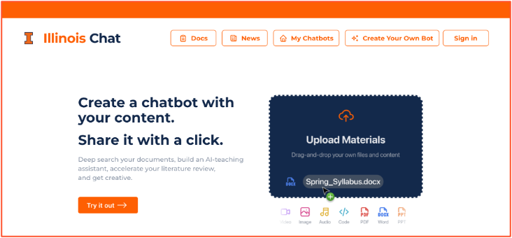

# Illinois Chat

**Illinois Chat is a self-hostable AI chat platform for building course, research, and organization-specific assistants over curated documents and web content.**

Upload your documents (or use the built-in web crawler), then chat with them. Ask questions, use it like search, have it review your grant proposals, and more. It excels at Q&A over an unlimited number of documents — some projects contain millions.

The campus-supported instance is available at [chat.illinois.edu](https://chat.illinois.edu), and the entire platform is [open source on GitHub](https://github.com/Center-for-AI-Innovation/Illinois-Chat) under the Apache License 2.0, so you can also [run it yourself](self-hosting/index.md).

## Why Illinois Chat?

- **Control over your information sources.** Unlike vendor-driven chat sites, your data is never used to train models. You decide exactly which documents your assistant knows about.
- **Source citations.** Answers cite their sources, so users can click through to the original documents you uploaded or crawled.
- **Robust platform features.** Authentication, sharing and access control, analytics, and support for many different language models.
- **User analytics.** When you share your assistant as a learning tool, Illinois Chat provides analytics on how users interact with it, helping you tailor your content.

## How it works

Illinois Chat uses **retrieval-augmented generation (RAG)**:

1. **Ingest** — documents are split into overlapping chunks and converted into embeddings.
2. **Index** — embeddings are stored in a per-project vector index, isolated from other projects.
3. **Retrieve** — each question is embedded and matched against the index to find the most relevant passages.
4. **Generate** — the retrieved passages are passed to a large language model, which produces a cited answer.

Learn more in [Concepts → Retrieval](concepts/retrieval.md).

## Top use cases

1. **AI teaching assistant** — create a virtual assistant for your courses that provides expert answers, cites sources, and encourages students to explore primary documents. It even [integrates with Canvas](guides/canvas-integration.md).
2. **Literature review** — upload academic PDFs or research papers and let the assistant help you find relevant information and citations.
3. **Project onboarding companion** — integrate resources like GitHub repos and PDFs to efficiently onboard team members.
4. **Advanced search tool** — use Illinois Chat over your curated content for fast, reliable information retrieval.

## Explore the docs

- :material-rocket-launch: **[Quickstart](getting-started/quickstart.md)** — create your first project and start chatting in minutes.
- :material-file-document-multiple: **[Guides](guides/uploading-materials.md)** — uploading materials, web crawling, sharing, tools, Canvas, analytics.
- :material-api: **[API Reference](api/index.md)** — integrate Illinois Chat into your own applications.
- :material-server: **[Self-Hosting](self-hosting/index.md)** — run the full stack yourself with Docker Compose.
- :material-sprout: **[CropWizard](cropwizard/index.md)** — the flagship agricultural assistant built on Illinois Chat.
- :material-post: **[Blog](blog/index.md)** — release notes and announcements.

## Acknowledgements

Illinois Chat is developed by the [Center for AI Innovation (CAII)](https://ai.ncsa.illinois.edu/) at the National Center for Supercomputing Applications (NCSA), University of Illinois Urbana-Champaign, with support from the Office of the CIO, the Healthcare Innovation Office at NCSA, and the Gies College of Business, among others.
