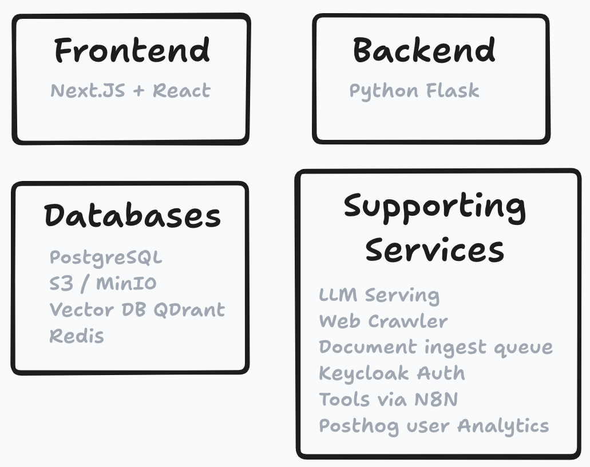
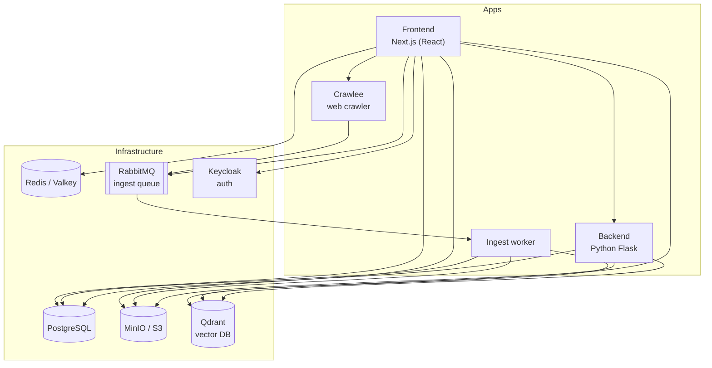
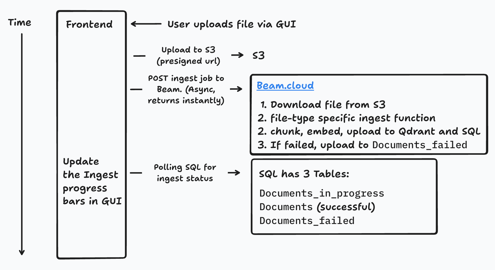

# System Architecture

The key priority of this architecture is developer velocity. Everything runs in Docker.

## The stack

**Frontend: React + Next.js** — the full-stack web application; most backend operations live in Next.js API routes.

**Backend: Python Flask** — used for Python-specific features such as advanced retrieval methods and Nomic document maps, plus the ingest worker.

**Databases:**

- **PostgreSQL** — main "top-level" storage; contains pointers to all other databases plus metadata.
- **MinIO / S3** — object storage for files (PDF, DOCX, MP4, ...).
- **Qdrant** — vector database for document embeddings.
- **Redis / Valkey** — user and project metadata; fast retrieval needed on every page load.

**Required stateless services:**

- **RabbitMQ ingest queue** — absorbs spiky ingest workloads without overwhelming the databases; jobs are processed by the ingest worker.
- **Keycloak** — user authentication (user data stored in Postgres).

**Optional add-ons:**

- **Ollama / vLLM** — local LLM serving.
- **Crawlee** — web crawling.
- **Nomic Atlas** — semantic maps of documents and conversation history.
- **N8N** — user-defined tool workflows.
- **Sentry** — error monitoring; **PostHog** — product analytics.

## RAG chat: what happens when you hit send?

1. The user submits a prompt.
    1. Determine whether tools should be invoked; if so, execute them and store the outputs.
2. Embed the user prompt with the embedding model.
3. Retrieve the most related documents from the vector database.
4. Prompt engineering to:
    1. pack as many documents as possible into the context window,
    2. retain as much conversation history as possible,
    3. include tool outputs and images,
    4. include user-configurable features (tutor mode, document references).
5. Send the final prompt to the LLM and stream the result.
    1. During streaming, a state machine replaces LLM citations with proper links — e.g. `[doc 1, page 3]` becomes a link to the document at the right page.

## Document ingest: how does it work?

1. The user uploads a document via the file-upload dropzone.
    1. Client-side check for supported filetypes.
    2. A presigned S3 URL is generated for a direct client → S3 upload (bypassing the app servers to save bandwidth).
    3. After the upload completes, an ingest job is posted to the queue.
2. The ingest worker picks up the job:
    1. The filetype is detected and the request forwarded to the matching ingest function (PDF, Word, Excel, ...). Each function shares the same interface: extract text plus per-page metadata, then call `split_and_upload()`.
    2. [Duplicates are detected](../concepts/documents.md#duplicate-handling) and skipped or replaced.
    3. Text is chunked, embedded, and uploaded to Qdrant and SQL. On failure, the job retries up to 9 times with exponential backoff.
3. Meanwhile, the frontend polls the database to show success/failure indicators in the UI.

### Ingest during web crawling

Crawled sources always link back to the original site, like a search engine. Compatible files (PDF, Word, PPT, Excel) are backed up to S3, but citations link to the original source, falling back to the local copy if the original 404s. HTML pages are not uploaded to S3 — their text is stored directly in SQL. See [Web Crawling](../guides/web-crawling.md).

## Where the code lives

| Path | Contents |
| --- | --- |
| `apps/frontend` | Next.js web application |
| `apps/backend` | Flask API and ingest worker |
| `apps/crawlee` | Crawlee web-crawling service |
| `infra/docker` | Docker Compose files |
| `infra/db` | Postgres schema and migrations |
| `infra/keycloak` | Keycloak realm and theme |
